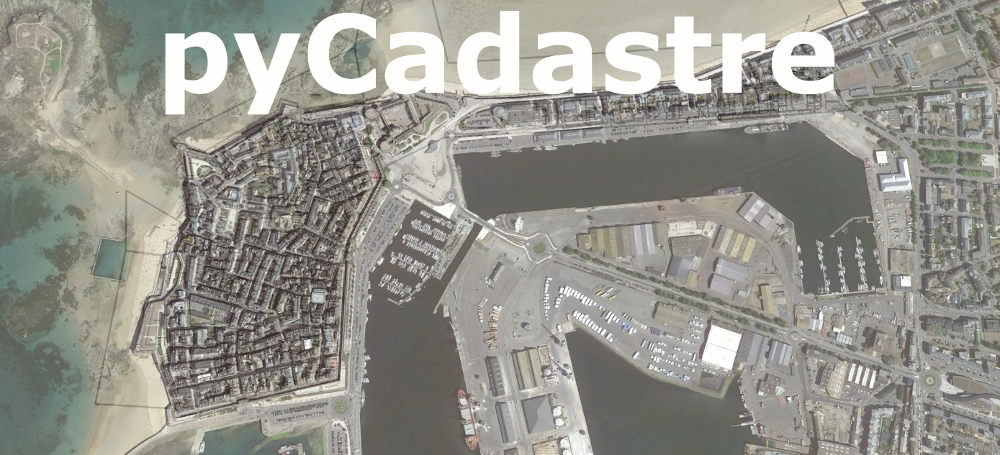

# pyCadastre 1.0

pyCadastre est un petit programme Python 3.11 qui télécharge et 
extrait les feuilles cadastrales d'une commune Française.

## Installation

   - Pas installation.

## Exigences

   - Seulement pour Windows

## Usage

  - Démarrer pyCadastre.

  - Saisir le numéro INSEE de la commune.

  - Attendre quelque secondes.

  - Un dossier contenant les dxfs a été créé: 'c:/Data/Carto/<Numéro Département>/<Numéro INSEE>'

## License

  - No license
